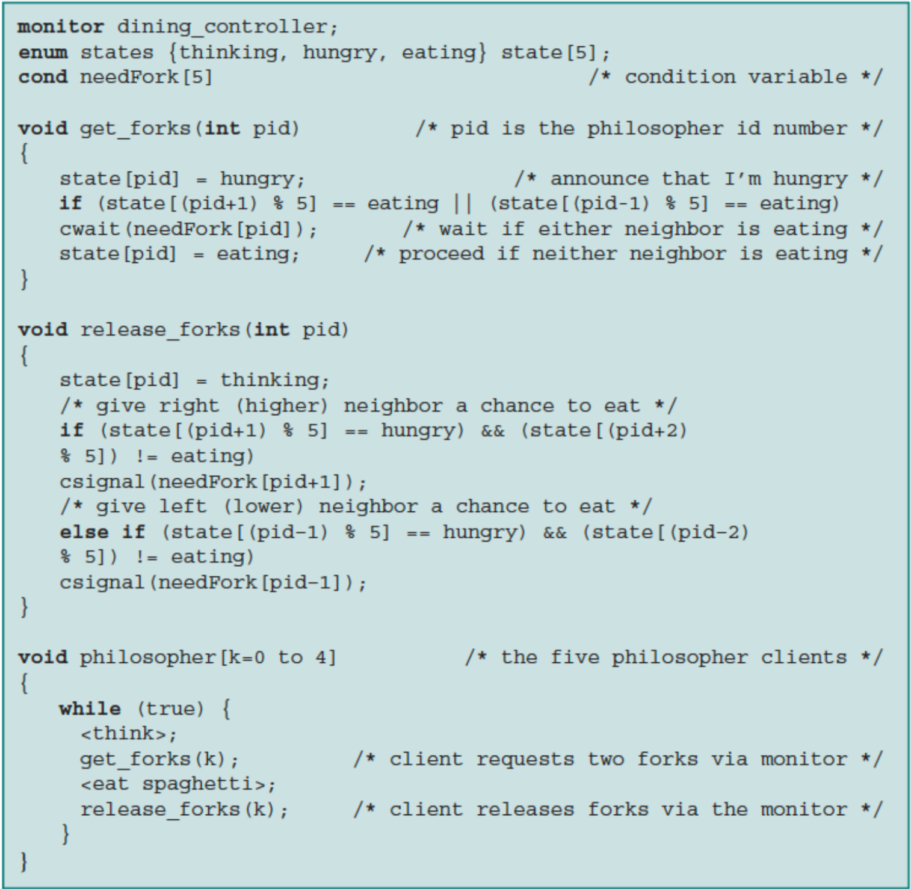
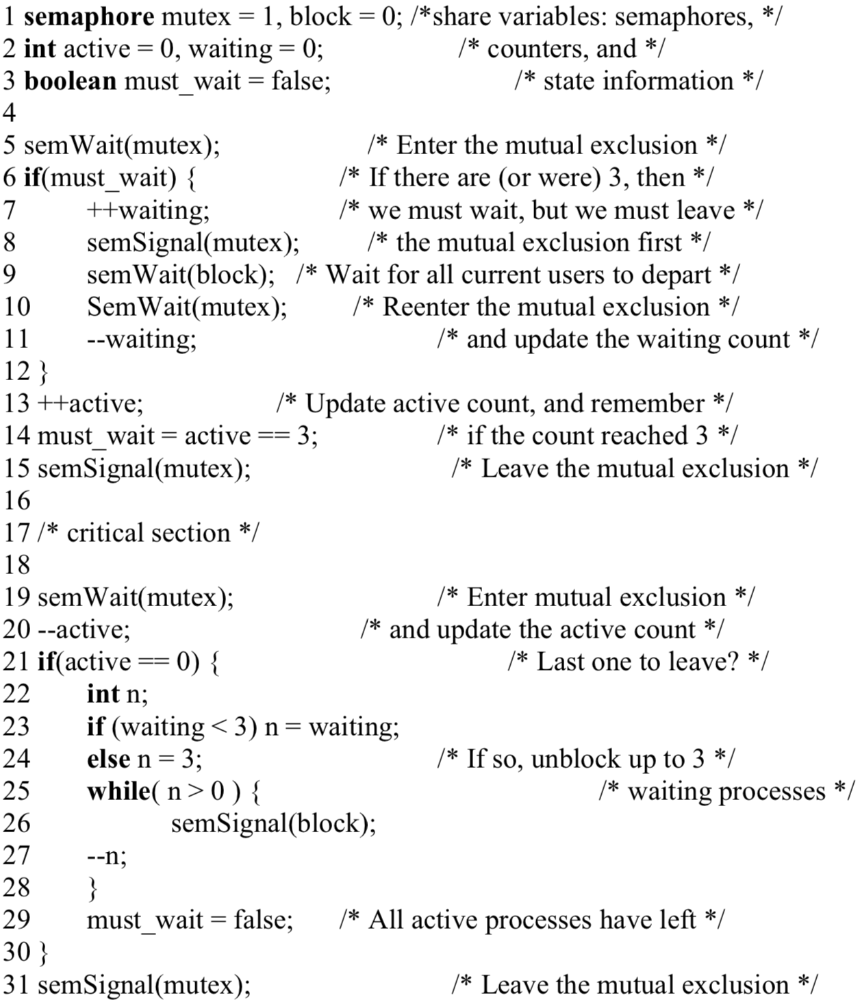
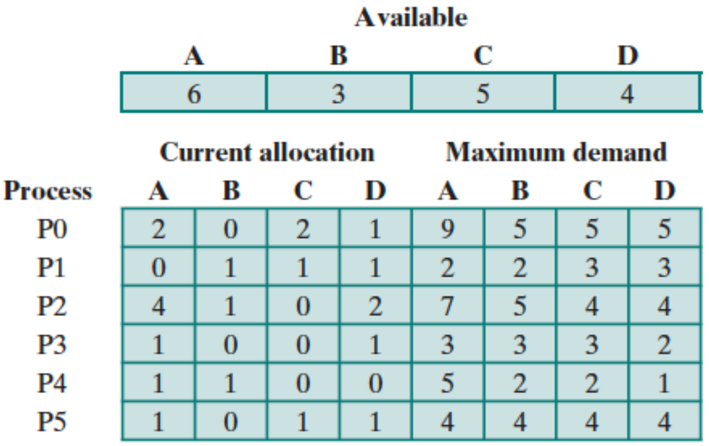
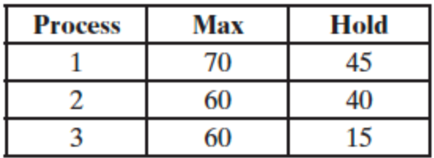
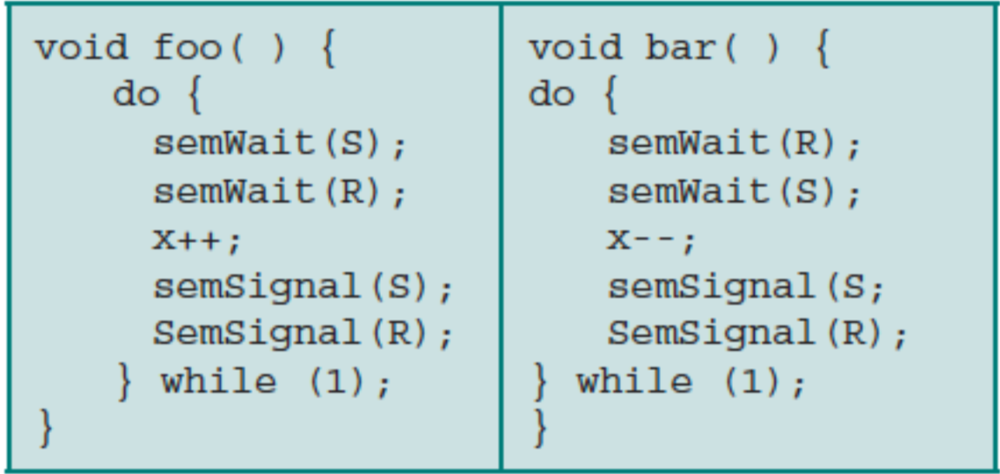

1. The following algorithms shows another solution to the dining philosophers
problem using monitors. Compare this solution to the solution to the dining
philosophers using monitors on the slides. Report your conclusions.

* Solution found on slides:
  * In the function `get_forks()`, forks are allocated for philosophers depending on whether the
    left or right philosophers' status.
  * This check on the left or right philosopher does check if that philosopher is eating, thinking,
    or hungry. Simply whether or not there is a fork available for this philosopher.

* The provided method in the problem:
  * The function `get_forks()` checks if the left or right philosopher is eating, if they are,
    do not fork yet, else, fork and change status to eating.
  * Enums are used in both `get_forks()` and `release_forks()` for clearly defined states.
    Where as the solution found in the slide is a little more confusing.

2. Consider a shareable resource with the following characteristics:

(1) As long as there are fewer than three processes using the resource, new processes can start
using it right away.

(2) Once there are three process using the resource, all three must leave before any new
processes can begin using it. We realize that counters are needed to keep track of how many
processes are waiting and active, and that these counters are themselves shared resources that
must be protected with mutual exclusion. So we might create the following solution:

The solution appears to do everything right: All accesses to the shared variables are protected
by mutual exclusion, processes do not block themselves while in the mutual exclusion,
new processes are prevented from using the resource if there are (or were) three active users,
and the last process to depart unblocks up to three waiting processes.

a. The program is nevertheless incorrect. Explain why.
* On line 10, `SemWait(mutex)`, allows a process that is already in the mutual exclusion to
  re-enter the mutual exclusion.

b. Suppose we change the if in line 6 to a while. Does this solve any problem in the
program? Do any difficulties remain?
* This does not solve any problems in the program. A new process may be incorrectly given
  the resource before the processes that are waiting in the queue. Thus, creating a
  starvation issue.

c. Propose a solution that fixes the above algorithm and explain why it is correct.
Assign the boolean value declared on line 3 to true to allow the while loop mentioned
earlier to run correctly.

3. Given the following state for the Banker’s Algorithm.

6 processes P0 through P5

4 resource types: A (15 instances); B (6 instances); C (9 instances); D (10 instances)
Snapshot at time T0:

a) Verify that the Available array has been calculated correctly.

Available:

| A | B | C | D |
|---|---|---|---|
| 6 | 3 | 5 | 4 |
* resource available for a process() = ([total resource required] - [sum current allocated resources])
* A = 15 - (2 + 4 + 1 + 1 + 1) = 6
* B = 6 - (1 + 1 + 1) = 3
* C = 9 - (2 + 1 + 1) = 5
* D = 10 - (1 + 1 + 2 + 1 + 1) = 4

The available array has been calculated correctly.

b) Calculate the Need matrix.
* need = maximum demand - current allocation

| Process  | A | B | C | D |
|:-:|:-:|:-:|:-:|:-:|
| P0 | 9-2=7 | 5-0=5 | 5-2=3 | 5-1=4 |
| P1 | 2-0=2 | 2-1=1 | 3-2=1 | 3-1=2 |
| P2 | 7-4=3 | 5-4=1 | 4-1=3 | 4-2=2 |
| P3 | 3-1=2 | 3-0=3 | 3-0=3 | 2-1=1 |
| P4 | 5-1=4 | 2-1=1 | 2-0=2 | 1-0=1 |
| P5 | 4-1=3 | 4-0=0 | 4-1=3 | 4-1=3 |

c) Show that the current state is safe, that is, show a safe sequence of processes. In
addition, to the sequence show how the Available (working array) changes as each
process terminates.

* num available resources for A, B, C, and D respectively: 6, 3, 5, 4

We can check the necessary resources for each process by consulting the need matrix. In order
to determine if the current state is safe, it is necessary to check whether all the processes
run to completion without a deadlock occuring.

* P1: Requires 2, 1, 1, 2, from A, B, C, D, respectively. This process is satisfied and runs to
completion.

Release all allocated resources to P1 and add to the available pool. The current allocated
resources to P1 are 0, 1, 1, 1.

The available resources are now 6, 4, 6, 5

* P2: For completion of process P2, the resources 3, 1, 3, 2 are required. The process is
satisfied and runs to completion.

  * Release all allocated resources to P2 and add to the available pool. The current allocated
  resources to P2 are 4, 1, 0, 2

  * The available resources are now 10, 5, 6, 5

* P0: For the completion of P0, the resources 7, 5, 3, 4 are required. The process is
satisfied and runs to completion.

  * Release all allocated resources to P0 and add to the available pool. The current allocated
  resources to P0 are 2, 0, 2, 1

  * The available resources are now 12, 5, 8, 6

* P3: For the completion of P3, the resources 2, 3, 3, 1 are required. The process is
satisfied and runs to completion.

  * Release all allocated resource to P3 and add to the available pool. The current allocated
    resources to P3 are 1, 0, 0, 1

  * The available resources are now 13, 5, 8, 7

* P4: For the completion of P4, the resources 4, 1, 2, 1, are rquired. The current allocated
  resources to P4 are 1, 1, 0, 0.

  * Release all allocated resource to P4 and add to the available pool. The current allocated
    resources to P4 are 1, 1, 0, 0

  * The available resources are now 14, 6, 8, 7

* P5: For the completion of P5, the resources 3, 0, 3, 3, are rquired. The current allocated
  resources to P5 are 1, 0, 1, 1.

  * Release all allocated resource to P5 and add to the available pool. The current allocated
    resources to P5 are 1, 0, 1, 1

  * The available resources are now 15, 6, 9, 8

d) Given the request (3,2,3,3) from Process P5. Should this request be granted? Why
or why not?

* P5's current allocation becomes 3, 2, 3, 3. P5's need matrix will become:

| Process  | A  | B | C | D |
|:-:|:-:|:-:|:-:|:-:|
| P5  | 4-3=1  | 4-2=2  | 4-3=1  | 4-3=1  |

Available resources are 4, 1, 3, 2. The needs matrix resources > available matrix resources.
This request will not be granted because it is not in a safe state.

4. Consider a system with a total of 150 units of memory, allocated to three processes as shown:

Apply the banker’s algorithm to determine whether it would be safe to grant each of the
following requests. If yes, indicate a sequence of terminations that could be guaranteed
possible. If no, show the reduction of the resulting allocation table.

a. A fourth process arrives, with a maximum memory need of 60 and an initial need of
25 units.

* total units of memory = 150
* available units of memory = 150 - (45 + 40 + 15 + 25) = 25

Allocate Process P1
P1: 70
P2: 70 + 60 - 20 = 110
P3: 110 + 60 - 45 = 125
P4: 125 + 60 - 35 = 150

It is safe to grant the request

b. A fourth process arrives, with a maximum memory need of 60 and an initial need of
35 units.

available = 150 - (45 + 40 + 15 + 35) = 15

The min needed for the second process is 20 but the total available is 15.

It is not safe to grant the request

5. Suppose the following two processes, foo and bar are executed concurrently and share the
semaphore variables S and R (each initialized to 1) and the integer variable x (initialized to 0).

a) Can the concurrent execution of these two processes result in one or both being blocked
forever? If yes, give an execution sequence in which one or both are blocked forever.

* Yes, the execution of these two process will result in on or both being blocked forever.
For example:
  * `foo()` executes `semWait(s)`, meanwhile, `bar()` executes `semWait(R)`.
  * Both process will be blocked when each process attempts to execture their next
  instructions. Both process will be waiting for a `semSignal()` from each other that will
  never occur.

b) Can the concurrent execution of these two processes result in the indefinite postponement of
one of them? If yes, give an execution sequence in which one is indefinitely postponed.
  * No. Both processes can be blocked and resumed.
