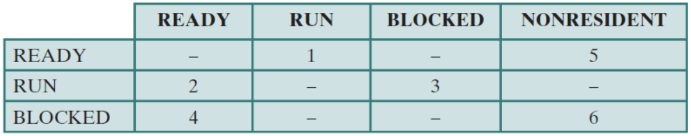
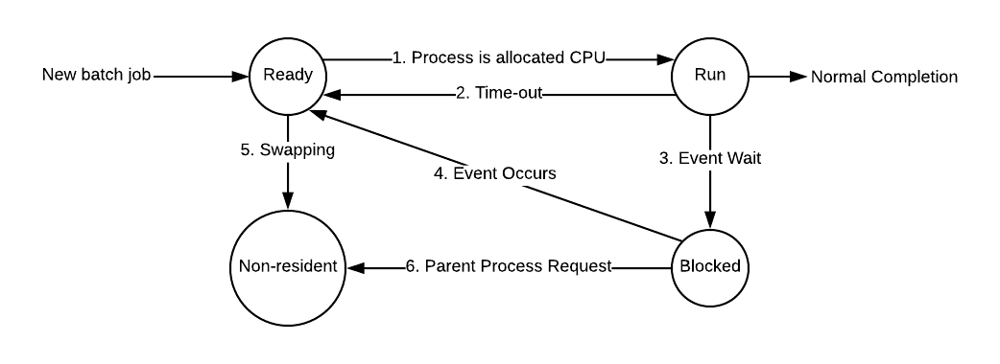
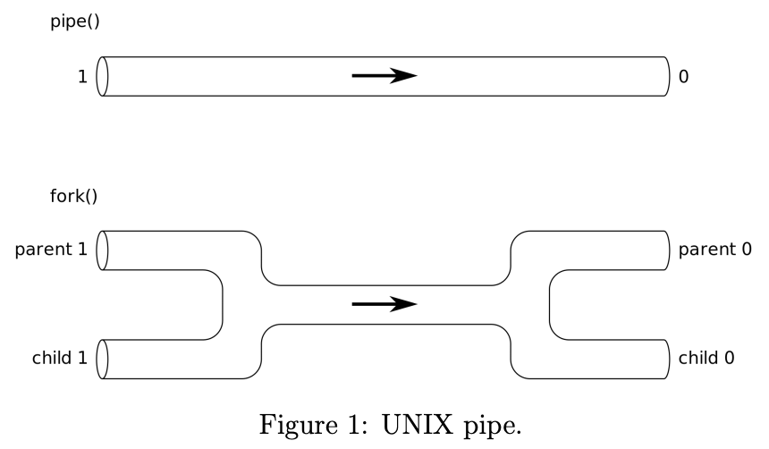

**Q .1**: Why are two modes (user and kernel) needed? What is the difference between an
      interrupt and a trap?

The user mode is needed for user programs. User programs should not utilize certain areas of memory that
are protected from the user. Also, user programs should not use certain instructions that are available in kernel mode.
The kernel mode is necessary in order to extract privileged instructions and access protected areas of memory.
An interrupt disrupts the normal sequenceing of the processor. Interrupts are used to improve processor utilization. A
trap occurs when an error or exception is generated within a currently running process.

**Q.2**: The following state transition table is a simplified model of process management, with
     the labels representing transitions between states of READY, RUN, BLOCKED, and
     NONRESIDENT.

  

     Give an example of an event that can cause each of the above transitions. Draw a
     diagram if that helps.

  

# 1 ps and kill
The `ps` ( i.e., process status) command is used to provide information about the currently
running processes, including their process identification numbers (PIDs). A process, also
referred to as a task, is an executing ( i.e. running) instance of a program. Every process is
assigned a unique PID by the system.

**Question 3**: Explain what the following options will do when used with `ps`:
  * `ps -e`
      * Display information about other users' processes, including those without controlling terminals.
  * `ps -l`
      * Display information associated with the following keywords: **uid**, **pid**, **ppid**, **flags**, etc

**Question 4**: Combine `ps` with `grep` to get the PID of a process (e.g., FireFox). Then,
            use the `kill` command to send a SIGTERM signal to that process.

            ps -ef | grep firefox | grep -v grep | awk '{print $2}' | xargs kill -9

# 2 Fork
System call `fork()` is used to create processes. It takes no arguments and returns a process
ID. The purpose of `fork()` is to create a new process, which becomes the child process of the
caller. After a new child process is created, both processes will execute the next instruction
following the `fork()` system call. Therefore, we have to distinguish the parent from the
child. This can be done by testing the returned value of `fork()`:

* If `fork()` returns a negative value, the creation of a child process was unsuccessful.
* `fork()` returns zero to the newly created child process.
* `fork()` returns a positive value to the parent. The returned process ID is of type **pid t**
  defined in `sys/types.h`. Normally, the process ID is an integer. Moreover, a process
  can use function `getpid()` to retrieve the process ID assigned to this process.

Consider the following example:
```c
#include <stdio.h>
#include <unistd.h>
#include <stdlib.h>
#include <sys/types.h>

int main () {
  if(fork() == 0) {
    printf("This is the child process\n");
  } else {
    printf("I am the parent process\n");
  }
  printf("Both parent and child reach here.\n");
  return 0;
}
```
**Question 5**: How many times will the message "Both parent and child reach here" be printed?
* The message "Both parent and child reach here" will print twice.

**Question 6**: Explain what the command `pstree` does.
* `pstree` produces nicely formatted process family trees. It is used as a more visual alternative to `ps`.

# 3 Pipe
A pipe is a mechanism provided by the operating system that lets one process send a stream
of bytes to another one. Since a child process inherits all open descriptors from the parent
when it is created, we can create a pipe (which is a pair of connected descriptors) before
creating the child process, thus allowing both processes access to the same pipe (see Figure 1).
In order to create a pipe, you first need to create a file descriptor:
```
int fd[2];
```
The first integer in the array (element 0) is set up and opened for reading, while the second
integer (element 1) is set up and opened for writing. Visually speaking, the output of `fd[1]`
becomes the input for `fd[0]`. All data traveling through the pipe moves through the kernel.
In case of a `fork()`, if the parent wants to receive data from the child, it should close
`fd[1]`, and the child should close `fd[0]`. If the parent wants to send data to the child, it
should close `fd[0]`, and the child should close `fd[1]`. Since descriptors are shared between
the parent and child, we should always be sure to close the end of pipe we aren’t concerned
with. On a technical note, the EOF will never be returned if the unnecessary ends of the pipe
are not explicitly closed. The following example should clarify the above description:



```c
#include <stdio.h>
#include <stdlib.h>
#include <string.h>
#include <unistd.h>
#include <sys/types.h>

int main(void) {
  int fd[2], nbytes;
  pid_t childpid;
  char string[] = "We love COMS 352 !\n";
  char readbuffer[80];
  pipe(fd);

  if((childpid = fork()) == -1) {
    perror("fork");
    exit(0);
  }
  if(childpid == 0) {
    close(fd[0]);
    write(fd[1], string, (strlen(string) + 1));
    exit(0);
  } else {
    close(fd[1]);
    nbytes = read(fd[0], readbuffer, sizeof(readbuffer));
    printf("Received string: %s", readbuffer);
  }
  return 0;
}
```
# Question 7: You are to write a C/C++ program that
* Creates a child and a parent process
* The child process receives 1-byte integers from the keyboard one at a time.
  Upon getting each new input, it should send it to the parent process using a pipe
  until the input is ‘-1’.
* When the parent process receives ‘-1’, it should
  * compute the sum of all the integers it has received, and
  * send the result to the child process using another pipe.
* When the child process receives the result, it displays the result on screen and
  terminates
