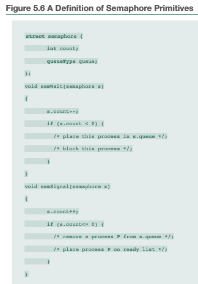

1. (10 points) Demonstrate the correctness of Dekker’s algorithm.

  a. Show that mutual exclusion is enforced. __Hint: Show that when P1 enters its critical
     section, when the following expression is true: `flag[i]` and (not `flag[1 - i]`)__
  * P1 will only enter its critical section if `flag[0]` is false. When `flag[0]` is false,
    `flag[1]`  will have been set to true, therefor, mutual exclusion is enforced because
    when we reach the critical section, the expression `flag[i] && !(flag[1 - i])` will
    be true. Also, P2 does not modify `flag[1]`. Thus, the above expression must be true.

  b. Show that a process requiring access to its critical section will not be delayed
     indefinitely. __Hint: Consider the following cases: (1) a single process is attempting
     to enter the critical section; (2) both processes are attempting to enter the critical
     section, and (2a) turn = 0 and `flag[0]` = true, and (2b) turn = 0 and flag[0] = true__

  (Case 1): A single process is attempting to enter the critical section
  * If only one process is attempting to enter the critical section, `flag[1 - i]` will be false.
  The process will enter the criticial section with no delay.

  (Case 2): Both processess are attempting to enter the critical section, and (2a) turn = 0 and flag[0].
  * In order to enter the critical section for P0, `!(flag[1]) && flag[1 - i]` must be true. As for P1,
  `flag[i] && !(flag[1 - i])` must be true.

  (2a): Consider `flag[0] = true` and `turn = 0`. P0 will wait in the first while loop and not enter
  the internal loop until `flag[1] == true`. P1 will set `flag[1] = false`, because `flag[0] == true`
  and `turn == 0`, P1 will wait in its internal loop on `while (turn == 0)`. Then, P0 will meet the
  criteria of entering the critical section.

  (2b): Consider `turn = 0` and `flag[0] = false`. P1 will enter its critical section immediately,
  as seen in part 1(a)


2. (10 points) Consider the following program:
```c
P1: {
  shared int x;
  x = 10;
  while (1) {
    x = x - 1;
    x = x + 1;
    if (x != 10) {
      printf(“x is %d”,x)
    }
  }
}
```
```c
P2: {
  shared int x;
  x = 10;
  while(1) {
    x = x - 1;
    x = x + 1;
    if(x != 10) {
      printf(“x is %d”,x)
    }
  }
}
```
Note that the scheduler in a uniprocessor system would implement pseudo-parallel execution of
these two concurrent processes by interleaving their instructions, without restriction on the
order of the interleaving.

a. Show a sequence (i.e., trace the sequence of interleavings of statements) such that the
   statement “x is 10” is printed.
   ```c
   P1: x = x - 1 /* x = 9 */
   P2: x = x - 1 /* x = 8 */
   P2: x = x + 1 /* x = 9 */
   P2: (x != 10) == true
   P1: x = x + 1 /* x = 10 */
   P2: printf("x is %d", x) /* "x is 10" */

   ```
b. Show a sequence such that the statement “x is 8” is printed. You should remember that the
   increment/decrements at the source language level are not done atomically, that is, the
   assembly language code:
   ```
   LD   R0,X  /* load R0 from memory location x */
   INCR R0    /* increment R0 */
   STO  R0,X  /* store the incremented value back in X */
   ```
   ```c
   P1: LD   R0  X   10, 10
   P1: DECR R0      10, 9
   P1: STO  R0  X    9, 9
   P2: LD   R0, X    9, 9
   P2: DECR R0       9, 8
   P2: STO  R0, X    8, 8
   P1: LD   R0, X    8, 8
   P1: INCR R0, X    8, 9
   P2: LD   R0, X    8, 8
   P2: INCR R0, X    8, 9
   P2: STO  R0, X    9, 9
   P2: (x != 10) == true; printf("x is %d", x) /* "x is 9" */
   P1: STO  R0, X    9, 9
   P1: (x != 10) == true
   P2: LD   R0, X    9, 9
   P2: DECR R0, X    9, 8 /* because of while(1) loop */
   P2: STO  R0, X    8, 8
   P1: LD   R0, X    8, 8
   P1: printf("x is %d", x) /* "x is 8" */
   ```

3. (10 points) Consider the following program:
```c
const int n = 50;
int tally;
void total() {
  int count;
  for (count = 1; count<= n; count++) {
    tally++;
  }
}
void main() {
  tally = 0;
  parbegin(total(), total());
  write(tally);
}
```
a. Determine the proper lower bound and upper bound on the final value of the shared variable
   tally output by this concurrent program. Assume processes can execute at any relative speed
   and that a value can only be incremented after it has been loaded into a register by a
   separate machine instruction.

   * Let P1 and P2 denote the two calls to `total()`. If P1 increments tally to 50 before P2 loads
   tally's value at the specified address, then P2 will increment tally to 100. If P1 and P2 load
   tally, and P1 increments tally to 49 and then stores it, it is possible that P2 could increment
   tally to 1 and store it, overwriting the value of 49 that was stored by P1. Then P1 could read
   tally at the value of 1, and then P2 could increment tally 49 times and store it in the register.
   Then there is a possibility that P1 would override the value 50 stored by P2, resulting in
   `tally = 2`. The lower bound of tally is 2 and the uppder bound is 100.

b. Suppose that an arbitrary number of these processes are permitted to execute in parallel
   under the assumptions of part (a). What effect will this modification have on the range of
   final values of tally?

   * Let n be the number of arbitrary number of processes that are permitted to execute in parallel.
   The upper bound will 50n and the lower bound will stay the same, 2 (see answer to part a).

4. (15 points) Consider the following definition of semaphores:
```c
void semWait(s) {
  if (s.count > 0) {
    s.count--;
  } else {
    place this process in s.queue;
    block;
  }
}
void semSignal (s) {
  if (there is at least one process blocked on semaphore s) {
    remove a process P from s.queue;
    place process P on ready list;
  } else {
    s.count++;
  }
}
```



Compare this set of definitions with that of Figure 5.6. Note one difference: With
the preceding definition, a semaphore can never take on a negative value. Is there any
difference in the effect of the two sets of definitions when used in programs? That is, could
you substitute one set for the other without altering the meaning of the program?
* In the alt set of definitions in the function `semSignal`, `s.count` is not always
incremented as it is in Figure 5.6. Also note that `s.count` is always decremented in Figure 5.6
where as in the alternative definition it is not. However, the functionality of both
definitions remain the same. It is possible to substitute one set for the other without
altering the meaining of the program.

5. (15 points) It should be possible to implement general semaphores using binary semaphores.
   We can use the operations `semWaitB` and `semSignalB` and two binary semaphores, delay and mutex.
   Consider the following:
```c
void semWait(semaphore s) {
  semWaitB(mutex);
  s--;
  if (s < 0) {
    semSignalB(mutex);
    semWaitB(delay);
  } else {
    SemsignalB(mutex);
  }
}

void semSignal(semaphore s); {
  semWaitB(mutex);
  s++;
  if (s <= 0) {
    semSignalB(delay);
  }
  semSignalB(mutex);
}
```
Initially, `s` is set to the desired semaphore value. Each `semWait` operation decrements `s`,
and each `semSignal` operation increments `s`. The binary semaphore mutex, which is initialized to 1,
assures that there is mutual exclusion for the updating of `s`. The binary semaphore delay, which
is initialized to 0, is used to block processes. There is a flaw in the preceding program.
Demonstrate the flaw and propose a change that will fix it.

__Hint: Suppose two processes each call `semWait(s)` when s is initially 0, and after the
first has just performed `semSignalB(mutex)` but not performed `semWaitB(delay)`,
the second call to `semWait(s)` proceeds to the same point.  All that you need to
do is move a single line of the program.__

* Let the two process be named P1 and P2 respectively. Suppose two processes each call
`semWait(s)` when s is initially 0, `mutex` is then initialized to 1. P1 performs
`semSignalB(mutex)` but not yet performed `semWaitB(delay)`. P2 also proceeds to the same point.
We are now deadlocked since both processes are waiting on the binary semaphore to be 0. A fix
to this issue is to remove the `else` statement. This will allow executing `SemsignalB(mutex)`.
This, freeing the binary semaphore and removing the deadlock.
